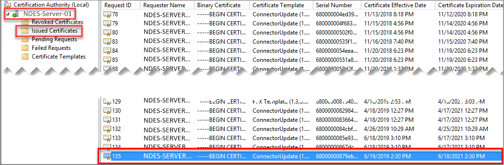

---
# required metadata

title: Troubleshoot delivery of certificates to devices when you use SCEP with  Microsoft Intune | Microsoft Docs
description: Troubleshoot the delivery of a certificate to a device from the CA when using SCEP certificate profiles with Intune to deploy certificates.
keywords:
author: brenduns
ms.author: brenduns
manager: dougeby
ms.date: 01/15/2020
ms.topic: conceptual
ms.service: microsoft-intune
ms.subservice: configuration
ms.localizationpriority: high
ms.technology:

# optional metadata

#ROBOTS:
#audience:
#ms.devlang:
ms.reviewer: lacranda
ms.suite: ems
search.appverid: MET150
#ms.tgt_pltfrm:
ms.custom: intune-azure
ms.collection: M365-identity-device-management
---

# Troubleshoot the delivery of certificates provisioned by SCEP to devices in Intune

Use the information in this article to help you investigate delivery of certificates to devices when you use Simple Certificate Enrollment Protocol (SCEP) to provision certificates in Intune. After the Network Device Enrollment Service (NDES) server receives the requested certificate for a device from the certification authority (CA), it passes that certificate back to the device.

This article applies to the step 5 of the [SCEP communication workflow](../troubleshoot-scep-communication.md); delivery of the certificate to the device that submitted the certificate request.

## Review the certification authority

When the CA has issued the certificate, you'll see an entry similar to the following example on the CA:

## Review the Windows device

On the Windows device, verify the certificate was delivered:

1. Open Event Viewer, look for **Event 39** in the following location: **Applications and Services Logs** > **Microsoft** > **Windows** > **DeviceManagement-Enterprise-Diagnostic-Provider** > **Admin**.

   Look for entries where **Event ID** = **39**. This Event should have a general description of: **SCEP: Certificate installed successfully.**

   

2. On the device, run **certmgr.msc** to open the Certificates MMC and verify that the root and SCEP certificates are installed correctly on the device:

   1. Go to **Certificates (local Computer)** > **Trusted Root Certification Authorities** > **Certificates**, and verify that the root certificate from your CA is present. The values for *Issued To* and *Issued By* will be the same.
   2. In the Certificates MMC, go to **Certificates – Current User** > **Personal** > *Certificates*, and verify the requested certificate is present, with *Issued By* equal to the name of the CA.

### When the certificate isn’t successfully delivered

To troubleshoot issues with the certificate not being installed on the device, look in the Windows Event log for errors that suggest problems:

- On the device, open Event Viewer, and then go to **Applications and Services Logs** > **Microsoft** > **Windows** > **DeviceManagement-Enterprise-Diagnostic-Provider** > **Admin**.

Errors with delivery and installation of the certificate to the device are typically related to Windows operations, and not to Intune.

## Next steps

When the certificate successfully deploys to the device, but Intune doesn't report success, see [NDES reporting to Intune](troubleshoot-scep-certificate-reporting.md) to troubleshoot reporting.
